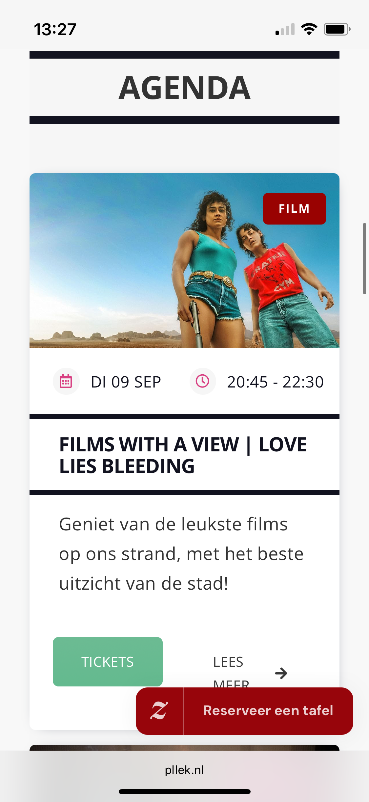
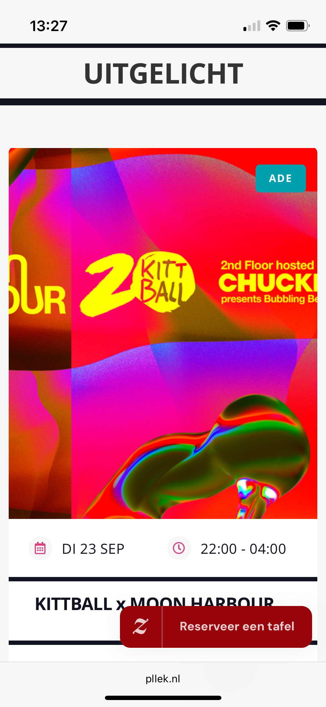

# Procesverslag
Markdown is een simpele manier om HTML te schrijven.  
Markdown cheat cheet: [Hulp bij het schrijven van Markdown](https://github.com/adam-p/markdown-here/wiki/Markdown-Cheatsheet).

Nb. De standaardstructuur en de spartaanse opmaak van de README.md zijn helemaal prima. Het gaat om de inhoud van je procesverslag. Besteedt de tijd voor pracht en praal aan je website.

Nb. Door *open* toe te voegen aan een *details* element kun je deze standaard open zetten. Fijn om dat steeds voor de relevante stuk(ken) te doen.

## Jij

  
uitwerken voor kick-off werkgroep

  ### Auteur:
  Sam Fee Haarsma

  #### Je startniveau:
  Blauw

  #### Je focus:
  responsive
 

## Je website

  
uitwerken voor kick-off werkgroep

  ### Je opdracht:
  https://pllek.nl/ 

  #### Screenshot(s) van de eerste pagina (small screen): 
  Hoofdpagina  
   
   
   

  #### Screenshot(s) van de tweede pagina (small screen):
  Agenda  
   
   
 

## Toegankelijkheidstest 1/2 (week 1)

  
uitwerken na test in 2e werkgroep

  ### Bevindingen
  Lijst met je bevindingen die in de test naar voren kwamen:
  -Met de tab-toets kun je over de hele pagina gaan. Hij volgt alle knoppen in volgorde. Ook is er een onzichtbare toets bovenin de pagina te vinden waarmee je gelijk naar de inhoud kunt.
  -De screenreader leest bij sommige dropdownmenus niet de juiste inhoud. Zo zegt hij bij de dropdown cadeubon "canadese dollar".
  -De inhoud van de teksten en koppen leest de screenreader niet, alleen de links. Ook als ik de screenreader op woorden of koppen zet.
  -Op de agenda pagina van de website leest de screenreader wel het eerste kopje en tekst maar daarna niet meer. Dit kan zijn omdat ik niet goed weet hoe het werkt of omdat het niet werkt voor screenreaders.
  -Het contrast-ratio tussen tekst en achtergrond is goed te zien op de website.
  -De pllek website gebruikt voor knoppen zowel rood als groen. Ik denk niet dat dit in de weg gaat zitten voor mensen die kleurenblind zijn.
  -De website heeft geen dark mode.
  

## Breakdownschets (week 1)

  
uitwerken na afloop 3e werkgroep

  ### de hele pagina: 
   
    

## Voortgang 1 (week 2)

  
uitwerken voor 1e voortgang

  ### Stand van zaken
  Ik liep nog een beetje achter, ik had alleen een breakdown schets gemaakt. De schets zag er goed uit, er moesten nog een paar dingen aangepast worden. Er moest nog een aparte screenshot gemaakt worden van de header want die stond er nog niet op. De icoontjes op de pagina zijn meestal SVG's. En er kan maar 1 navigatie op de pagina staan. Ik had er twee gebruikt, voor de header en footer. Dit moet daarom nog aangepast worden zodat de nav in de footer veranderd wordt naar linkjes in een ul.

  ### Verslag van meeting
  - Aparte screenshots maken van de header voor op de breakdownschets.
  - SVG iconen zoeken voor op de website.
  - Maar 1 navigatie op de pagina gebruiken.

## Voortgang 2 (week 3)

  
uitwerken voor 2e voortgang

  ### Stand van zaken
  hier dit ging goed & dit was lastig (neem ook screenshots op van delen van je website en code)

  ### Agenda voor meeting
  samen met je groepje opstellen

  | student 1      | student 2          | student 3    | student 4        |
  | ---            | ---                | ---          | ---              |
  | dit bespreken  | en dit             | en ik dit    | en dan ik dat    |
  | en dat ook nog | dit als er tijd is | nog een punt | dit wil ik zeker |
  | ...            | ...                | ...          | ...              |

  ### Verslag van meeting
  hier na afloop snel de uitkomsten van de meeting vastleggen

  - punt 1
  - punt 2
  - nog een punt
- ...

## Toegankelijkheidstest 2/2 (week 4)

  
uitwerken na test in 9e werkgroep

  ### Bevindingen
  Lijst met je bevindingen die in de test naar voren kwamen (geef ook aan wat er verbeterd is):

## Voortgang 3 (week 4)

  
uitwerken voor 3e voortgang

  ### Stand van zaken
  hier dit ging goed & dit was lastig (neem ook screenshots op van delen van je website en code)

  ### Agenda voor meeting
  samen met je groepje opstellen

  | student 1      | student 2          | student 3    | student 4        |
  | ---            | ---                | ---          | ---              |
  | dit bespreken  | en dit             | en ik dit    | en dan ik dat    |
  | en dat ook nog | dit als er tijd is | nog een punt | dit wil ik zeker |
  | ...            | ...                | ...          | ...              |

  ### Verslag van meeting
  hier na afloop snel de uitkomsten van de meeting vastleggen

  - punt 1
  - punt 2
  - nog een punt
  - ...

## Eindgesprek (week 5)

  
uitwerken voor eindgesprek

  ### Je uitkomst - karakteristiek screenshots:
  

  ### Dit ging goed/Heb ik geleerd: 
  Korte omschrijving met plaatjes

  

  ### Dit was lastig/Is niet gelukt:
  Korte omschrijving met plaatjes

  

## Bronnenlijst

  
continu bijhouden terwijl je werkt

  Nb. Wees specifiek ('css-tricks' als bron is bijv. niet specifiek genoeg). 
  Nb. ChatGpT en andere AI horen er ook bij.
  Nb. Vermeld de bronnen ook in je code.

  1. [bron 1](https://pllek.nl/)
  2. bron 2
  3. ...

